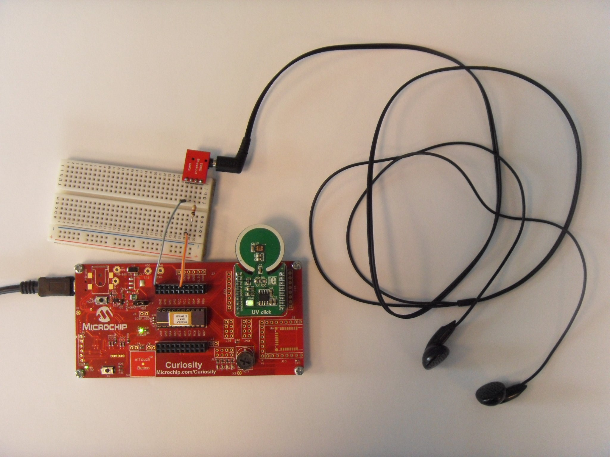
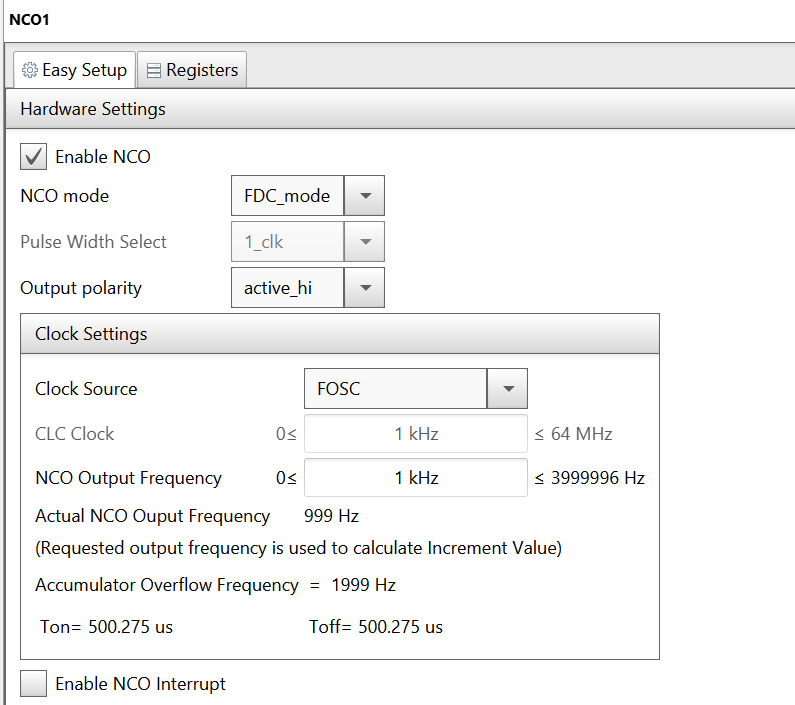
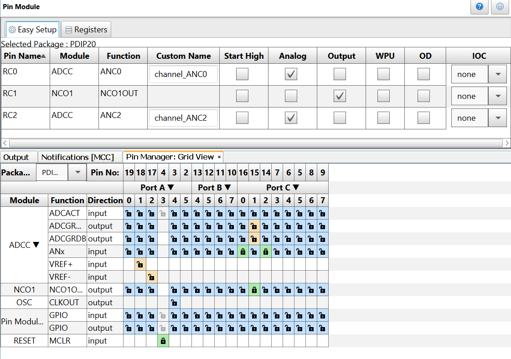

# Introduction #

In this project I use the Analog-to-Digital Converter with Computation (ADCC) of the PIC16F18446 to read the UV Click Board. Then I use the Numerically Controlled Oscillator (NCO) to generate a tone with variable pitch according to the UV level. Since the UV sensor has an offset, I use the POT1 on the Curiosity board to get an adjustable offset that I then subtract from the sensor reading.

# Description #

In this demo,

* PIC16F18446 (20-pin, PDIP) MCU is used to read an UV Click

* The NCO of the PIC is used for generating a tone with variable pitch according to the UV light intensity

* The Curiosity development board is used as it supports a mikroBUS slot for MikroElektronika™ click boards and has got on-chip programmer and debugger.
In order to hear the tone, you need to connect headphones in series with 1k resistor to RC1 and GND.

# Software Tools #

Make sure the latest MCC libraries for PIC16F18446 MCU are installed. The demo/example uses the following version of software tools from Microchip:

* MPLAB® X IDE v5.30

* MPLAB® Code Configurator (Plugin) v3.85.1

* MCC Core v4.85

* Microcontrollers and peripherals Library v1.78.1

# Demo Hardware Setup #

* Plug the PIC16F18446 MCU into its socket on the Curiosity board

* Plug the UV Click into the mikroBUS slot of the Curiosity board

* Connect headphones in series with 1k resistor to RC1 and GND

# MCC Settings #

This section shows the settings used in the demo/example for various MCU modules configuration. These settings were done using the Microchip Code Configurator (MCC). Open MCC to look at the settings of the modules.

## System Module Settings ##

The MCU uses the high frequency internal oscillator (HFINTOSC), and the clock is set to 8 MHz. Watchdog Timer is not used in this demo, so it is disabled.

## ADCC Settings ##

The ADCC is configured with a clock of FOSC/64, basic operation mode.

## NCO Settings ## 

The NCO is configured in FDC mode, with FOSC set as clock source, and an initial output frequency of 1 kHz.

## Pin Manager Settings ## 

The pins are configured as follows:

* Pin RC2 is set as analog input (ANC2) for reading the UV Click

* Pin RC0 is set as analog input (ANC0) for reading the POT1

* Pin RC1 is set to be the output of NCO1

# Operation # 
1. After making the above hardware connections, build demo firmware and load the generated hex file onto the PIC16F18446 MCU.
2. When the demo firmware is loaded, listen to the headphones and you will hear a tone
3. Vary the POT1 to adjust the offset
4. Vary the UV light intensity on the sensor and notice the changing frequency of the tone.

# Conclusion # 

This example shows how easy it is to use the PIC16F18446 and MCC to read an analog UV light intensity sensor and generate a variable frequency tone using the NCO.
